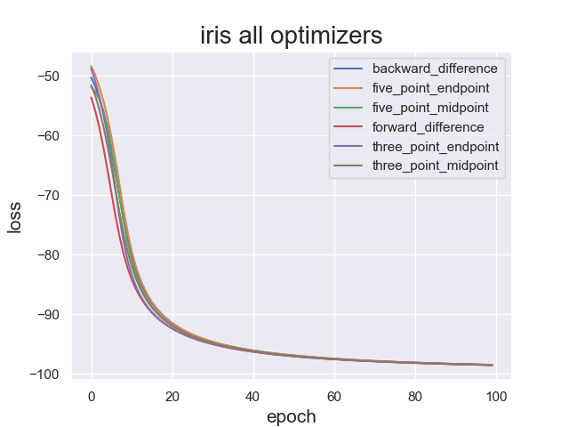
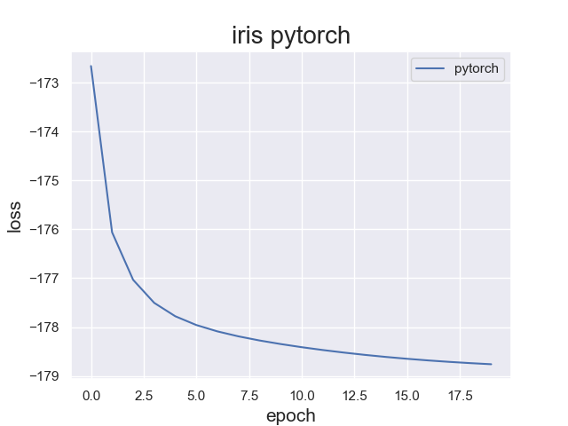

# Deep Learning Toolkit from Scratch Using Numerical Differentiation
Toolkit for building and training deep learning models. Built from scratch.

In this project, I develop a deep learning toolkit from scratch for building and training neural networks. The optmizers make use of numerical differnetiation algortihms to compute the gradient tensor. Other useful tools are included in the package such as a logger using Tensorboard and a plotter using Seaborn. 



## About The Project
Machine learning is a field that revolves around developing methods and algorithms to make computers act intelligently without being explicitly programmed to do so. Acting intelligently usually consists of classification of some unknown data or making predictions based on past data. The toolkit that I will be developing is targeted towards building and training supervised learning models. Therefore the toolkit requires a dataset of input feature vectors along with the corresponding labels. The toolkit is also designed to handle both classification and regression models. 

### Overview of the training process
The training begins by forward propagating a feature vector and obtaining the estimated output. The difference between the estimated output and the desired output is called the loss. The objective is now to determine how to update the parameters to reduce the loss. This is achieved by computing the gradient of the parameter tensor, in other words, it's the partial derivative of the loss with respect to individual parameters while keeping the other parameters fixed. Graphically, the gradient of a function outputs a vector pointing in the direction of steepest ascent. Therefore the loss can be reduced by taking a small step in the opposite direction of the gradient vector. This is known as taking a gradient step. The training process can be summarised into the following steps: 

* Compute the estimated output by forward propagation
* Compute loss using the estimated output and the desired output
* Compute the gradient tensor
* Update the parameters by taking a small step in the opposite direction of the gradient tensor

### Gradient Calculation
To calculate the gradient I have implemented 6 methods to numerically compute the derivative of a function at a point with respect to a variable.
* Forward difference
* Backward difference
* Three point endpoint 
* Three point midpoint
* Five point endpoint
* Five point midpoint

### Results
The results found below show the training process while using the Iris flower classification dataset found in sklearn. The training was done using all 6 methods of differentiation and was finally compared to a model built and trained on Pytorch. 

As you can see from the results the differentiation formula that was used did not significantly affect the outcome for this specific dataset. In comparison to a model trained in Pytorch, both performed with similar accuracies on the training and testing datasets, however the Pytorch model converged within 20 epochs while the other model took 100 epochs to converge. In addition, the time taken to train one epoch was much shorter on the Pytorch model.


## Getting Started

### Prerequisites
* The program was created using **Python3.7**
* **Numpy**
* **Seaborn**
* **Tensorboard**
* **Pandas**
* **Sklearn** (optional)

### Installation
To install the Deep Learning Toolkit, install the required librarires and clone this repository using the following commands:
```
pip install numpy
pip install seaborn
pip install tensorboard
pip install pandas
pip install scikit-learn
git clone https://github.com/kousheekc/Deep-Learning-Toolkit-using-Numerical-Differentiation
```

## Usage
To use the Deep Learning Toolkit, you can either create a new neural network model by using the train.py as reference or you can run the existing example. Navigate to the folder you just cloned and run the following command:
```
python3 -m deep_learning_toolkit.train
```
Once the algorithm begins you can open a tensorboard session to track the progress.


## License
Distributed under the MIT License. See [LICENSE](LICENSE) for more information.

## Contact
Kousheek Chakraborty - kousheekc@gmail.com

Project Link: [https://github.com/kousheekc/Deep-Learning-Toolkit-using-Numerical-Differentiation](https://github.com/kousheekc/Deep-Learning-Toolkit-using-Numerical-Differentiation)


### Deep Learning Toolkit


### Pytorch




## Results


